Data Analysis And Data Modeling
========================================================
title: 
author: Pavan Akula

_RDBMS Prespective_

Data Analysis - Starts with Data
========================================================
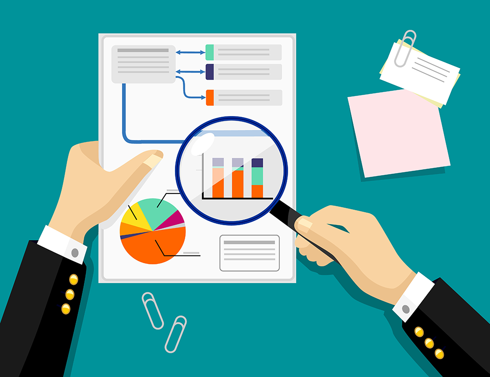
***
Data can often be represented or abstracted as an `{n x d}` data matrix, with n rows and
d columns. Rows may be referred to as entities, instances, records, transactions, tuples, and so
on. On the other hand, columns may be called attributes, properties, features, dimensions,
variables, fields. 

Data Analysis - Business needs
========================================================
- Data Analysis is set of tools and techniques.

- Discovering insightful, interesting, and novel patterns.

- Descriptive, understandable, and predictive models.

- Pattern mining, clustering, classification, and forecasting.

**_Data Analysis leads to Information._**

Data Modeling - Managing data
========================================================
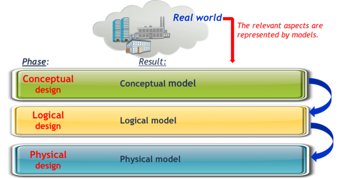
***
Data modeling is a set of tools and techniques to understand and analyze how to collect, update and store data. Traditionally Data Models used in practice falls into three categories.

Data Modeling - Concepts
========================================================
- Conceptual data models aka _Domain models._

- Logical data models describe _entity types and attributes_ and relationships between the entities.

- Physical data models aka _Database._ All the object that make up the database including schemas, tables, and columns.

**_Data Modeling ends with collecting and managing data._**

Data Modeling - Big Picture
========================================================
- Conceptual data model, give broad description about the businenss needs. Facts or things needed to conduct business.

- It represents how business is done in real world.

- Should be able to be understood by Business users.

- It typically describes an entire enterprise and its business concepts.

- It's highly abstract in nature, often used on strategic data projects.

- Customer, Product, Store, Location, Asset.

Data Modeling - Big Picture
========================================================
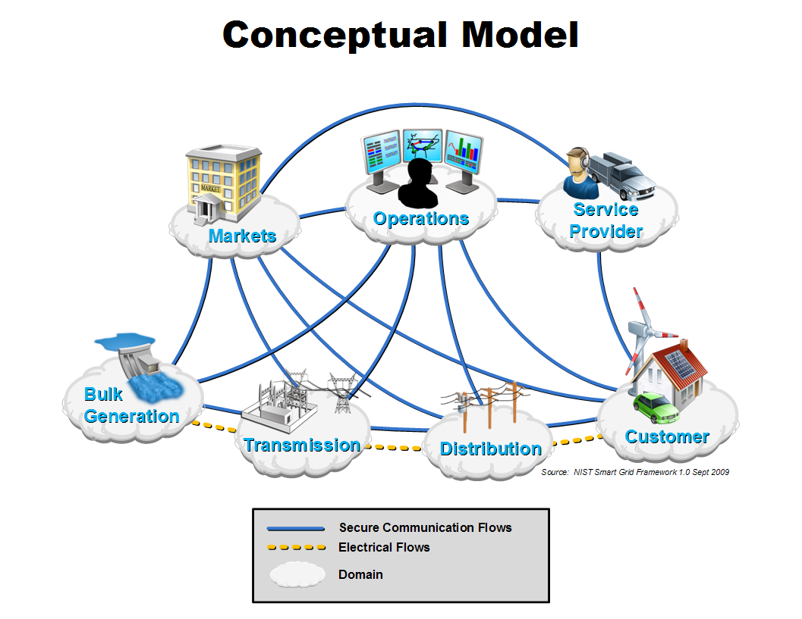

Data Modeling - Digging deeper
========================================================
- A logical data model is a fully-attributed data model that is independent of DBMS.

- Data attributes are well established, datatypes with precisions and lengths assigned.

- Entities and attributes will have definitions.

- Logical models are created using information gathered from business requirements.

- This is a bridge between the Conceptual data model and Physical data model.

Data Modeling - Digging deeper
========================================================
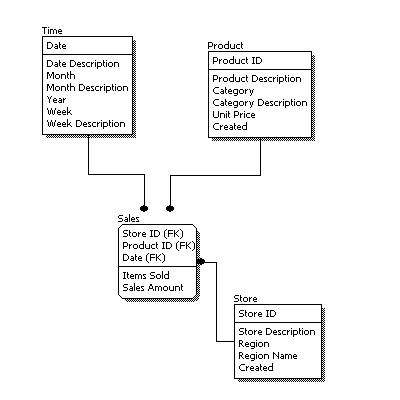

Data Modeling - Detail Oriented
========================================================
- Physical data model represents the actual design blueprint of a relational database.

- Represents how data should be structured and related in a specific database

- Accurate use of data type is needed for entity columns.

- Based on RDBMS reserved words has to be avoided in naming entities and columns.

- Primary keys, foreign keys, and constraints are well defined.

Data Modeling - Detail Oriented
========================================================

Data Modeling - Jargon
========================================================
Database Functional Implementation
- OLTP - Online transaction processing system
- CRM - Customer resourse management system
- ERP - Enterprise resourse planning system
- OLAP - Online analitical processing
- Star Schema
- Snowflake Schema

***
Major RDBMS
- Oracle
- MS SQL Server
- SAP Sybase Anywhere
- MySQL
- IBM DB2

Case - Study
========================================================
Pew Research Center and Smithsonian magazine conducted a national survey _U.S. Views of Technology and the Future_ which asked Americans about a wide range of potential scientific developments from near-term advances like robotics and bioengineering, to more "futuristic" possibilities like teleportation or space colonization. More information can be found at http://www.pewinternet.org/2014/04/17/us-views-of-technology-and-the-future/. PDF file  _Feb_2014_Views_Future_Crosstab.pdf,_ will be used to demonstrate relation between Data Analysis and Data Modeling.

Scope and Requirements
========================================================
- This is crosstab report.

- Business Analyst needs partial data.

- For the scope of the presentation partial report is used.

- Data needs to be stored in the RDBMS database.

- Showcase Star Schema and Snowflake Schema.

Star Schema - Crow's Foot Cardinality Notation
========================================================
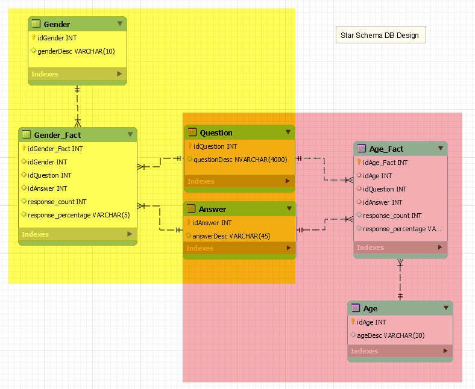

Database - Tables
========================================================
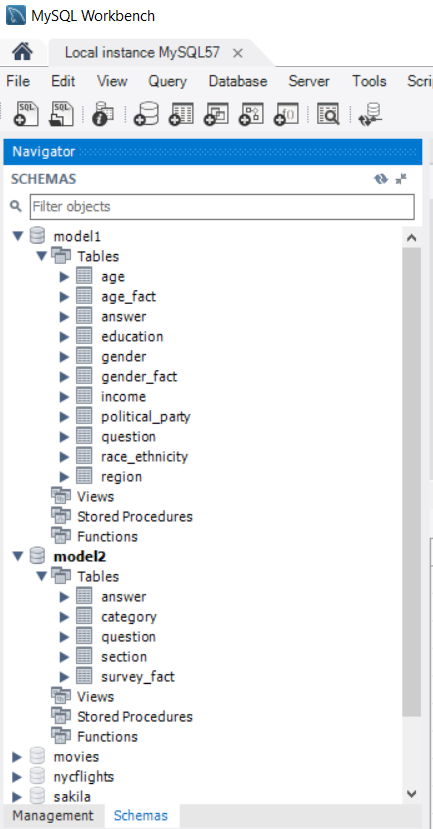

Star Schema - Question table
========================================================
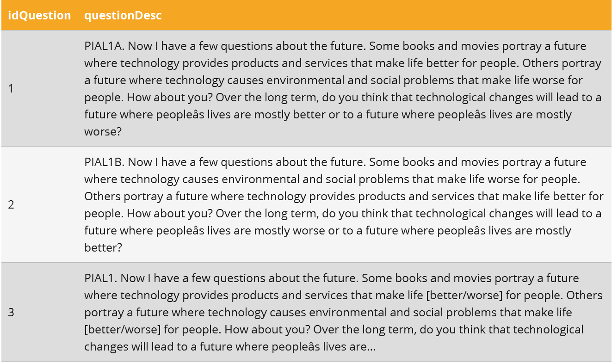

Star Schema - Answer table
========================================================
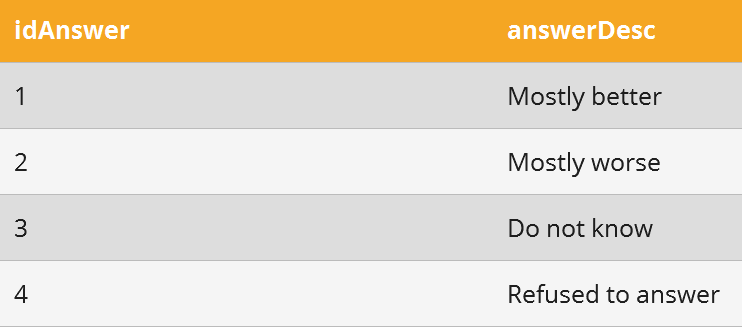

Star Schema - Age table
========================================================
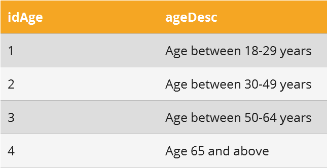

Star Schema - Age fact table
========================================================
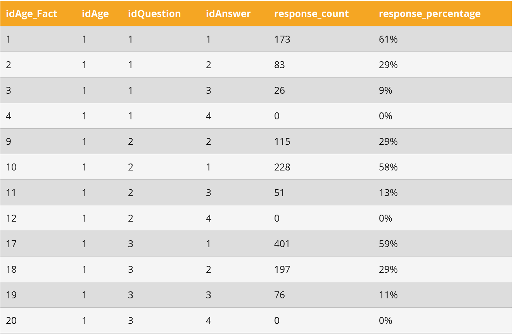

Snowflake Schema - Crow's Foot Cardinality Notation
========================================================

Snowflake Schema - Section table
========================================================
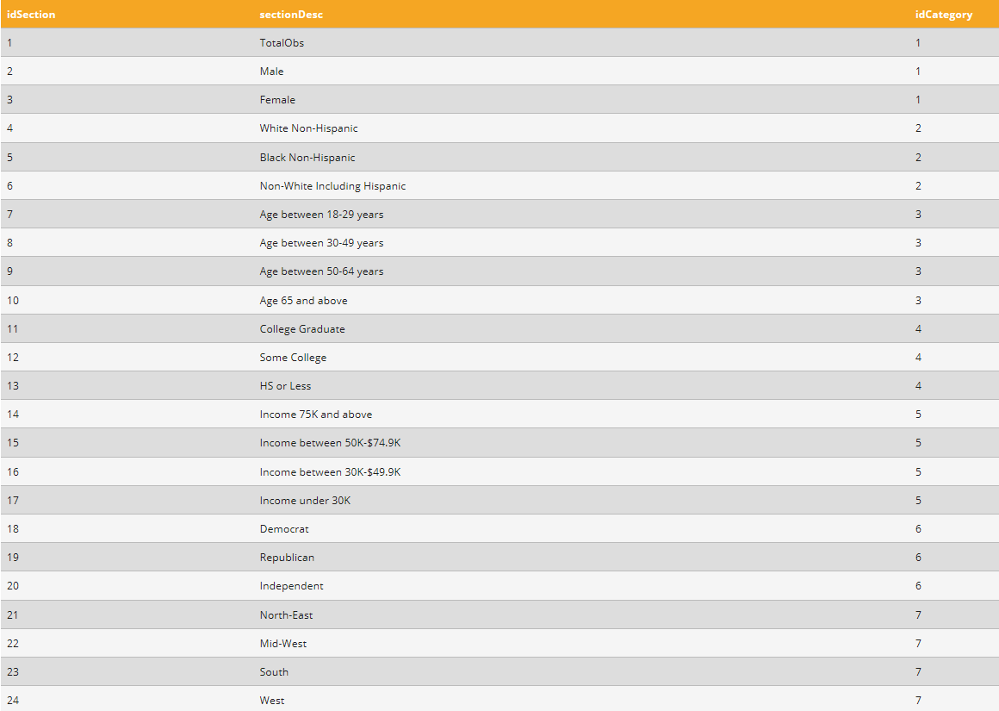

Snowflake Schema - Category table
========================================================
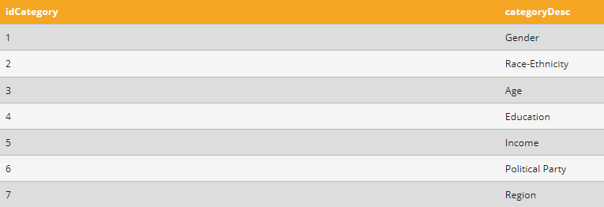

Snowflake Schema - Survey Fact table
========================================================
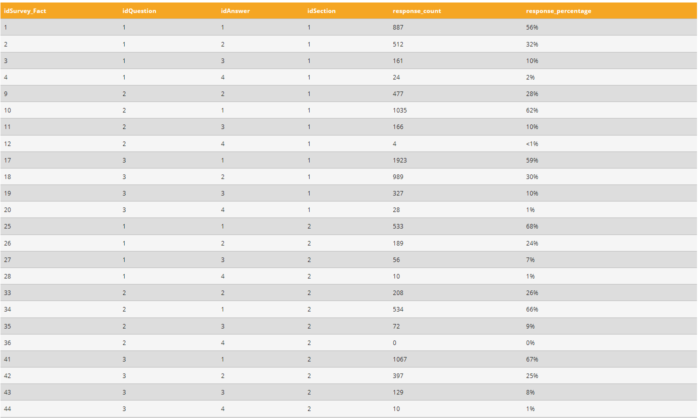

Snowflake Schema - Classic Cardinality Notation
========================================================
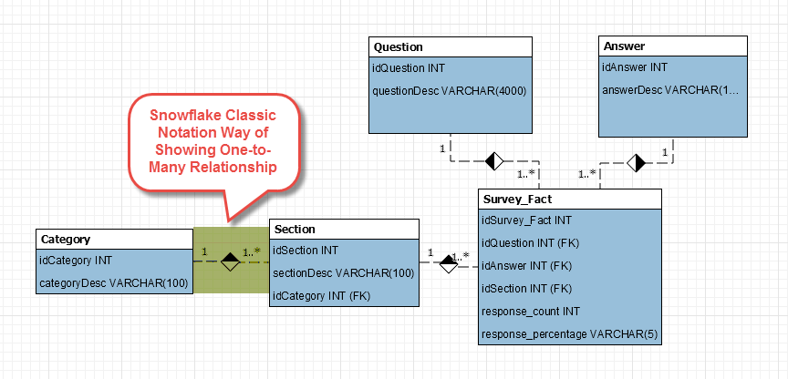

Snowflake Schema - Connect to Columns Cardinality Notation
========================================================
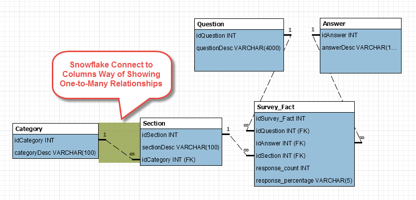

Snowflake Schema - Unified Modeling Language Cardinality Notation (UML)
========================================================
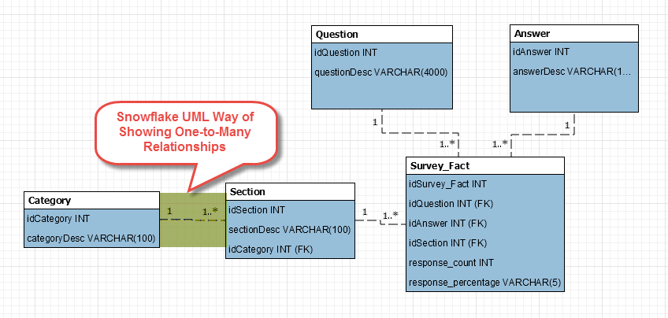

Snowflake Schema - IDE1FX Cardinality Notation
========================================================
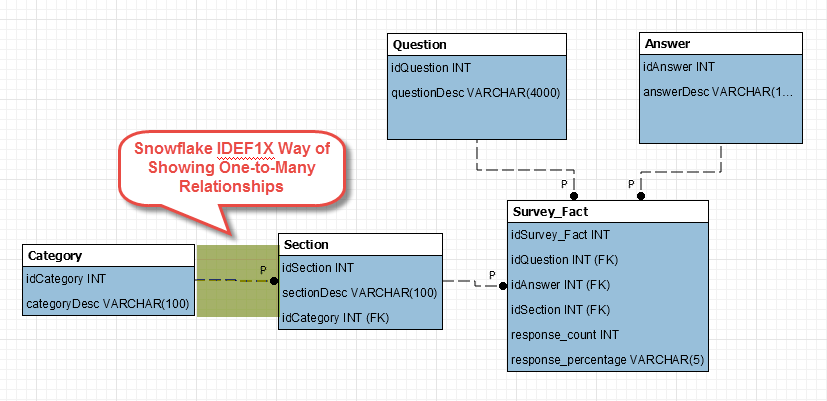
